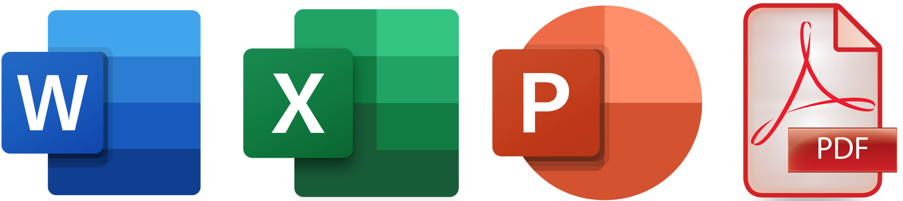
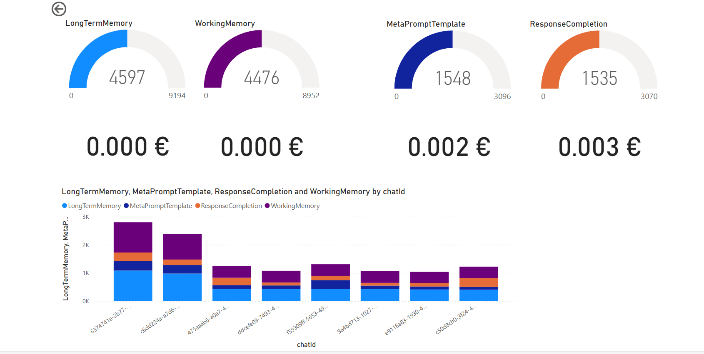

# CUSTOM Chat Copilot Application

> **IMPORTANT**
>
> This custom chat copilot application is a custom implementation of the original Chat Copilot sample :
>
> - Original Documentation : [Original Chat Copilot Sample](https://learn.microsoft.com/en-us/semantic-kernel/chat-copilot/)
> - Github Repository : [Original Chat Copilot Sample Github](https://github.com/microsoft/chat-copilot)
>
> Please refer to the original documentation for a first try or a first deployment.

# Differences with the original Sample

I updated and added some features.

# Custom Chat Skill

In the original sample, the process to create a system prompt was : create **audience** (who are in the chat), modify **intent** of the user's ask and others steps (WorkingMemory, longTermMemory and document memory). Audience and intent **use prompts and consomme some tokens**. In my case, we **don't need this 2 behaviors**.

**1. CustomChatSkill.cs**

So, I added a "CustomChatSkill.cs" file (in webapi/skills/ChatSkills/) that implement my own version of the chat skill. In this version I delete some methods (For Audiance and Intent). Audience is an empty string and Intent is the unchanged user's ask. This behavior is more like ChatGPT (or Azure OpenAI Studio with Chat mode).

**2. CustomBotResponsePrompt.cs**

To support the new CustomChatSkill, I needed to implement my own custom bot response : "CustomBotResponsePrompt.cs" (in webapi/Models/Response/). This class is a copy of the original "BotResponsePrompt.cs" with some modifications :

```csharp
public CustomBotResponsePrompt(
     string systemDescription,
     string systemResponse,
     string audience,
     string userIntent,
     string chatMemories,
     string documentMemories,
     SemanticDependency<StepwiseThoughtProcess> externalInformation,
     string chatHistory,
     ChatCompletionContextMessages metaPromptTemplate
 )
 {
     this.SystemPersona = string.Join("\n", systemDescription, systemResponse);
     //this.Audience = audience;
     //this.UserIntent = userIntent;
     this.PastMemories = string.Join("\n", chatMemories, documentMemories).Trim();
     this.ExternalInformation = externalInformation;
     this.ChatHistory = chatHistory;
     this.MetaPromptTemplate = metaPromptTemplate;
 }
```

**3. SemanticKernelExtension.cs**

In this file, I update the "RegisterChatSkill" method to use my own CustomChatSkill and CustomBotResponsePrompt. You well see an new instance of CustomChatSkill insted ChatSkill.

```csharp
   // Custom Chat skill
   kernel.ImportSkill(new CustomChatSkill(
            kernel: kernel,
            chatMessageRepository: sp.GetRequiredService<ChatMessageRepository>(),
            chatSessionRepository: sp.GetRequiredService<ChatSessionRepository>(),
            chatTokensUsageRepository: sp.GetRequiredService<ChatTokensUsageRepository>(),
            messageRelayHubContext: sp.GetRequiredService<IHubContext<MessageRelayHub>>(),
            promptOptions: sp.GetRequiredService<IOptions<PromptsOptions>>(),
            documentImportOptions: sp.GetRequiredService<IOptions<DocumentMemoryOptions>>(),
            contentSafety: sp.GetService<AzureContentSafety>(),
            planner: sp.GetRequiredService<CopilotChatPlanner>(),
            logger: sp.GetRequiredService<ILogger<ChatSkill>>()),
      nameof(CustomChatSkill));

   return kernel;
```

You can see the "chatTokensUsageRepository" parameter. I will explain it after.

# Memories

## Memories : PromptOptions

The original Chat Copilot use 2 concepts of memories : WorkingMemory and LongTermMemeory. Both of us are embedding in the VectorDB, retrieve by the system and added in the system prompt. In my case, we don't need it. So I update the "PromptOptions.cs" file (in webapi/Options/) to comment this memory for the collection.

```csharp
   // Memory map
   internal IDictionary<string, string> MemoryMap => new Dictionary<string,  string>()
   {
      //{ this.LongTermMemoryName, this.LongTermMemory },
      //{ this.WorkingMemoryName, this.WorkingMemory }
   };
```

# Documents ingestion




This custom Copilot chat use Azure intelligent Document to extract text from 

## SUPPORTED FORMAT

1. Microsoft Office files supported: 
   - DOCX
   - PPTX
   - XLSX

2. For **PDF** file, this application use Azure Intelligent Document too.


Than, If you have image with text in your file it works with Azure Intelligent Document.

On the original Copilot chat, pdf and docx are both convert ton text but only if file content texte format (not image).

# Tokens Usage

## 1. ChatTokensUsageRepository and ChatTokensUsage

An another usecase is to delete chat conversations after a delay, like 30 days. Because concersation historics are stored in the CosmosDB database, we can use the TTL feature to delete automatically old conversations.
But, in the same time, we want to know the tokens usages for all converations to track consumptions and costs.
So, I added a new CosmosDB container to store tokens usages for all conversations. This container is called "chattokensusage" in store DB (CosmosDB or filesystem or volatile memory).
To implemente it in Custom Copilot Chat, I added a new repository **"ChatTokensUsageRepository.cs"** (in webapi/Storage/) and a new model **"ChatTokensUsage.cs"** (in webapi/Models/Storage).

This is a sample of un document in this container :

```json
{
  "id": "9aa1f32b-eb84-4c97-8331-9c525866d6b2",
  "userId": "bot",
  "chatId": "f86b4d08-aff6-4fb6-a085-d2e23550a91d",
  "timestamp": "2023-09-19T16:58:50.1329614+00:00",
  "tokenUsage": {
    "metaPromptTemplate": 870,
    "responseCompletion": 239
  },
  "partition": "f86b4d08-aff6-4fb6-a085-d2e23550a91d"
}
```

> **IMPORTANT**
> 
> Than you need to add new container in CosmosDB database. For now, is not >implemented in Deployment script. So you need to add it manually.
> 
> Add a new container in CosmosDB database : **chattokensusage**
> With partition key : **/chatId**


## 2. ServiceExtensions

To use this new CosmosDB container, we need to update **ServiceExtension.cs** file (in webapi/Extentions/)

In **AddPersistentChatStore** method, you need to instantiate the new repository :

```csharp
   //CUSTOM
   chatTokensUsageStorageContext = new CosmosDbContext<ChatTokensUsage>(
   chatStoreConfig.Cosmos.ConnectionString, chatStoreConfig.Cosmos.Database, chatStoreConfig.Cosmos.ChatTokensUsageContainer);

```

And you can add the equivalent on each case in the switch statement.

## 3. PowerBI Report

To track tokens usages, I created a PowerBI report connected directly to the CosmosDB Container.



# Front features

I update the front application to disable Plugins, Plans & Personas but I will reactivate it soon. (A test for one of my customer)

# Next Features

1. Add an Azure function that will be triggered by a CosmosDB trigger to **delete vector index** in vector DB.
2. Add Semantic Memory for Document ingestion and Search when this framework support Postgres vectorDB.
3. Add a new feature to propose **3 nexts questions** that the user can ask after a bot response.
4. Reactivate **Plugins, Plans**
5. Add a **new plugins** to **show** how we can create and add plugins in this Copilot Chat.
6. Use Postgres for documents in chat session and Azure cognitive search for global document (with hybrid search). But, with plugin.

# Conclusion

It's easy to add or update some features in Copilot Chat. My updates accelerate the process, the bot responses are quicker and the user experience is better.
